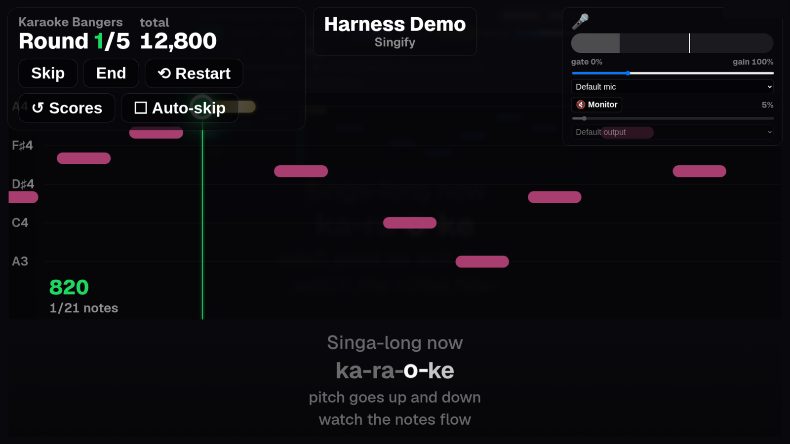
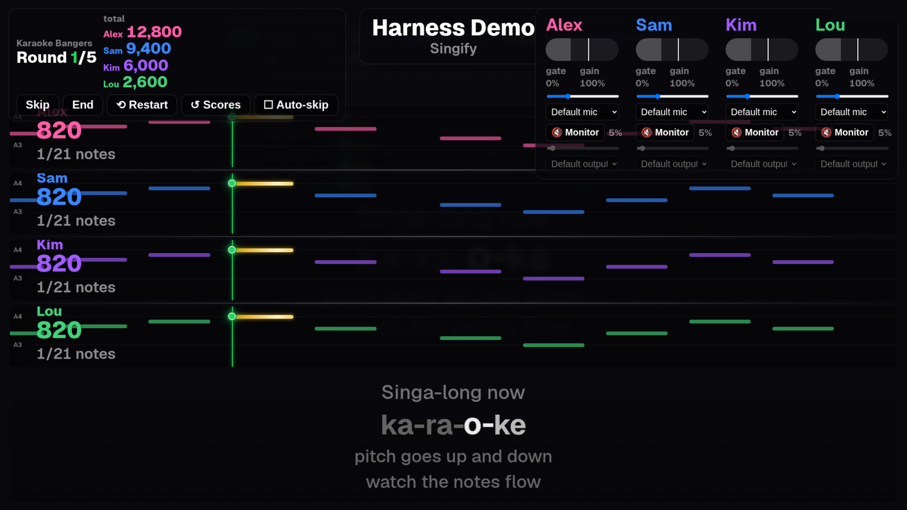
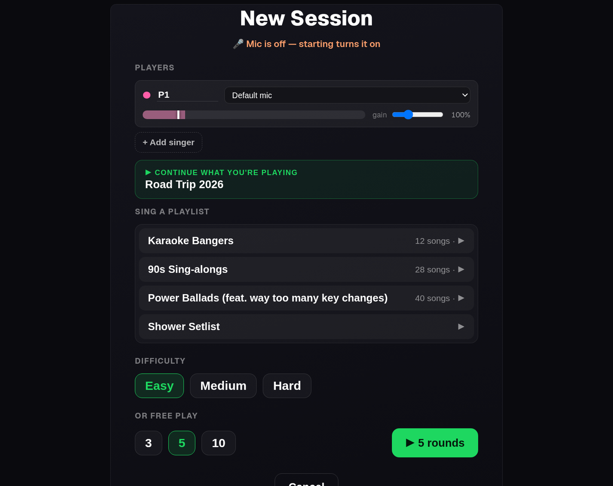
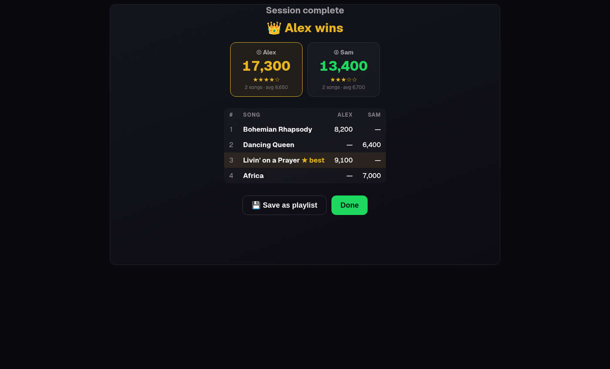

# Spicetify Karaoke (singify)

UltraStar karaoke **inside Spotify**, via Spicetify. When a song plays, singify
fetches the matching UltraStar `.txt` from USDB, parses it, and renders a
syllable-highlighted lyric scroll + pitch highway in a fullscreen overlay — then
scores your singing off the mic, solo or 1–4 players head-to-head.

**Stack:** Bun · TypeScript · Spicetify (Electron/Chromium renderer) · Linux (NixOS)

## Screenshots

| | |
| --- | --- |
| <br>**Solo stage** — pitch highway, live score, per-syllable lyric wipe, golden notes | <br>**1–4 players** — one coloured lane each, per-player score + mic |
| <br>**Start a session** — roster, playlist, difficulty, round count | <br>**Session results** — winner, star tiers, per-song breakdown |

## Why not fork an existing engine?

Existing engines (USDX, Vocaluxe, Performous, UltraStar Play, allkaraoke) own the
audio; Spotify never exposes decoded PCM (DRM), so that's impossible here. singify
rides only what Spotify *does* expose — the playback clock + the mic — overlaying
the chart on whatever's already playing.

## Approach: browser-first, Spotify later

The hard, iterative part — the karaoke rendering — is developed in a **plain
browser** with instant reload, no Spotify required. The *same* `KaraokeView`
component then runs unchanged inside Spotify. This works because of a small
ports-and-adapters split:

- **Shared core** — `ultrastar-parser.ts` (pure) and `karaoke-view.tsx`, which
  reads `Spicetify.React` and takes the playback position through a
  `getPositionMs()` prop. It has no idea which world it's in.
- **Two host adapters** fill those holes:
  - `dev/harness.tsx` — browser: fakes the `Spicetify` global with real React,
    drives a synthetic transport clock, feeds a fixture chart.
  - `src/index.ts` — Spotify: uses Spotify's injected React, interpolates the
    clock from `Player` events, resolves real charts.

Add a UI feature once (in the core) and both hosts get it for free. Every
screenshot above was captured straight from the browser harness.

## Status

singify **runs live in a real Spotify client**: mic scoring, lyric scroll, USDB
auto-resolve, sessions and the localhost helper all work end-to-end.

| Module | State |
| --- | --- |
| `src/ultrastar-parser.ts` | ✅ headers, beats→ms, RELATIVE, all note types `:`/`*`/`F`/`R`/`G` · tested |
| `src/usdb.ts` | ✅ USDB client (login, search-scrape, downloadTxt) · tested · runs in the helper |
| `src/cache.ts` | ✅ query sanitisation, fuzzy matching, on-disk song cache · tested |
| `src/resolver.ts` | ✅ cache + USDB flow, session-expiry re-login · tested |
| `src/karaoke-view.tsx` | ✅ pitch highway + per-syllable wipe + coloured versus lanes · browser + **live in Spotify** |
| `src/index.ts` (extension) | ✅ clock, overlay, `songchange`, hotkeys, sessions · **live in Spotify** |
| `server/helper.ts` (localhost bridge) | ✅ Bun HTTP server wrapping resolver/usdb/cache · CORS · lazy login + retry · has a USDB account |
| `src/resolver-client.ts` (thin client) | ✅ browser/Spotify side; same signatures as `resolver.ts`, fetches the helper |
| `src/mic.ts` + live pitch marker | ✅ getUserMedia → detectPitch → smoothed marker · per-player device, gain, gate, monitor-out |
| `src/scoring.ts` + result screen | ✅ beat-weighted 9000 + 1000 line bonus, golden 2×, octave-agnostic · **difficulty ±2/±1/±0** · rap (`R`/`G`) presence-scored · grade tiers |
| Sessions (`src/session.ts`, `session-view.tsx`) | ✅ multi-round, playlist-sourced, per-player scores, aggregate end-screen |
| Config + credentials | ✅ `~/.config/singify/config.json`, loaded by the helper |
| Stats + persistence (`stats.ts`, `persist.ts`, `server/store.ts`) | ✅ per-mic / per-singer aggregates · XDG-backed settings/offsets/stats mirrored via the helper |

**Tests:** `bun test` → **188 pass** (parser + cache/resolver + pitch + scoring +
session + stats + store + helper). No live USDB calls; everything is
fixture/mock/synthetic-tone.

## Dev workflow

```bash
nix develop            # or `direnv allow` once, then it auto-loads (flake.nix)
bun install            # first time only
bun test               # 188 tests
bun run dev            # browser harness → http://localhost:3000 (or next free port)
bun run helper         # localhost bridge → http://127.0.0.1:4455 (USDB + cache)
bun run build          # bundle → dist/karaoke.js
```

The harness renders the real components against a fixture chart with a
play/pause/seek transport. Deep-link any surface for dev or screenshots:
`?screen=ingame` (add `&players=4`), `?screen=session`, `?screen=result`,
`?screen=picker`. **Drop a real UltraStar `.txt` onto the stage** (or *Load .txt…*)
to test against real charts — no USDB account needed. Free CC-licensed charts:
[UltraStar-Deluxe/songs](https://github.com/UltraStar-Deluxe/songs).

### Hotkeys (in Spotify)

| Key | Action | Key | Action |
| --- | --- | --- | --- |
| `K` | Open the menu | `M` | Toggle mic(s) |
| `Q` | Quick Sing on the current track | `L` | Load a local `.txt` chart |
| `[` / `]` | Nudge lyrics later / earlier — ±10 ms (Shift ±100, Ctrl ±1) | `P` | Punch-sync (tap on the first word) |
| `\` | Reset sync | `R` | Re-search USDB (reopen the picker) |
| `-` / `=` | Mic sensitivity − / + | `,` / `.` | Hit-line nudge (visual only) |
| `F` | FPS · ms overlay (debug) | | |

The **offset** shifts the whole karaoke timeline against the audio (positive =
lyrics fire earlier), compensating for output latency and slightly-off UltraStar
`GAP` values. It's a property of the *clock*, saved **per track**, so it lives in
the adapters — `karaoke-view.tsx` never changed to add it.

**Mic sensitivity** (0–100%) is the mirror image — a property of the *mic* port
(the detector's RMS gate), so the view is again untouched. Higher = quieter
singing is detected (home alone); lower = rejects room/crowd noise (party). It's
per-player, live-adjustable from the in-game banner.

**Mic capture is raw by default** — `noiseSuppression`, `echoCancellation` and
`autoGainControl` are all off. Browser noise-suppression treats a sustained sung
note as stationary "noise" and ducks it (held notes fade after ~1–2 s); AGC pumps
the level and smears pitch. `getUserMedia` constraints are advisory, so `mic.ts`
reads back `track.getSettings()` and exposes it as `MicPitch.applied` (shown in the
harness Debug overlay).

## Where things live

Split by XDG class, so a `~/.cache` wipe only ever costs re-downloadable charts:

```
~/.cache/singify/           ← regenerable: chart downloads
  songs/Artist - Title [USDB-12345].txt
  cache.json                ← { [spotifyTrackId]: "./songs/…txt" }
~/.config/singify/          ← config: USDB creds + in-game settings
  config.json               ← usdbUser / usdbPass / port / cacheDir / chartsDir
  settings.json             ← mic gear, difficulty, gates, hit-line
~/.local/share/singify/     ← durable data (survives a cache wipe)
  offsets.json              ← per-track punch-ins
  stats.json                ← round history (drives the 📊 Stats screen)
```

localStorage stays the live store (it works with the helper off); the helper
mirrors the durable parts to these files (`/store/:name`) and reseeds localStorage
after a Spotify-profile wipe.

## The localhost helper (`server/helper.ts`)

Two pieces can't run inside Spotify's **Chromium renderer**: USDB auth needs real
`Cookie` / `Set-Cookie` headers (browsers forbid both, and usdb.animux.de sends no
CORS), and the cache needs `node:fs`. So the tested `resolver`/`usdb`/`cache`
modules run in **Bun**, behind a small HTTP server; the extension and harness are
thin `fetch` clients (`src/resolver-client.ts`) with the *same signatures* as
`resolver.ts`. That moved all of USDB + cache out of the extension bundle (zero
`node:fs` ships to the renderer).

```
GET  /health                        → { ok, hasCredentials }
GET  /resolve?trackId&artist&title  → ResolveResult
POST /pick { trackId, candidate }   → { song }
GET  /store/:name                   → the settings / offsets / stats doc
PUT  /store/:name                   → replace it (settings | offsets | stats)
```

The helper owns the one thing the resolver won't: credentials. It logs in lazily
and re-logs-in + retries once on session expiry.

**Config:** `~/.config/singify/config.json`
`{ "usdbUser": "…", "usdbPass": "…", "port": 4455, "cacheDir": "…" }`
(or `SINGIFY_USDB_USER` / `SINGIFY_USDB_PASS` / `SINGIFY_PORT`). Without
credentials the server still starts and `/health` works; `/resolve` returns 503.

> **Note:** the cache lives on disk behind the helper, so **the helper must be
> running even for already-cached songs** — the renderer has no filesystem of its
> own. Confirmed: Spotify's CSP *does* allow the renderer to `fetch` `127.0.0.1`,
> so no CSP patch is needed.

## Deploying into Spotify (NixOS / spicetify-nix)

This repo's owner runs Spicetify declaratively via `spicetify-nix`, where singify
is a custom extension entry (same shape as the `spicetify-visualizer` one). Loop:
`bun run build` → push → relock the `singify` flake input → `nh os switch`. Test an
unpushed build with `nh os switch -- --override-input singify git+file:///path/to/singify`.

## Notable design decisions

- **`saveSong(spotifyTrackId, usdbId, artist, title, txt)`** takes the Spotify
  track id first — `cache.json` is keyed by it.
- **`fuzzyMatch`** returns `max(editSimilarity, tokenOverlap)` — edit-similarity
  absorbs typos, token overlap absorbs word reorders. Auto-select threshold `0.85`.
- **Session expiry** surfaces as a typed `SessionExpiredError` from the resolver so
  the helper (which owns credentials) can re-login and retry. The resolver holds
  no credentials.
- **The pitch highway is DOM + CSS transform**, not canvas — a single
  GPU-composited `translateX` moves the note track. On this project's RDNA4 GPU
  (documented habit of crashing Spotify's GPU process on the wrong path) that's the
  safer *and* cheaper choice. Everything scales via CSS `zoom` off one root
  `UI_SCALE`, so the same layout fills a laptop or a 4K TV.

## Remaining work

- **Optional "live resolve" in the harness** — point the browser harness at the
  running helper so real charts render in-browser (today it uses mock candidates).
- **Solo Quick-Sing stats** — today only session rounds are recorded; wire
  `onComplete` for solo so practice runs count too.
